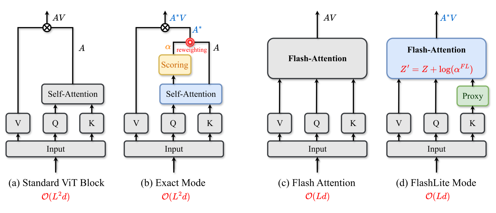
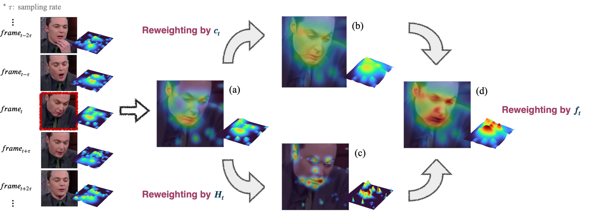

# MiRA: Reweighting Framewise Attention in Video Transformers for Facial Expression Understanding.
[Reweighting Framewise Attention in Video Transformers for Facial Expression Understanding (ECCV 2026)](https://arxiv.org/abs/2606.30611)  
Seongro Yoon1, Donghyeon Cho2, Jinsun Park3, François Brémond1  
1 Inria, Université Côte d'Azur, France  2 Hanyang University, South Korea  3 Pusan National University, South Korea

  

  

