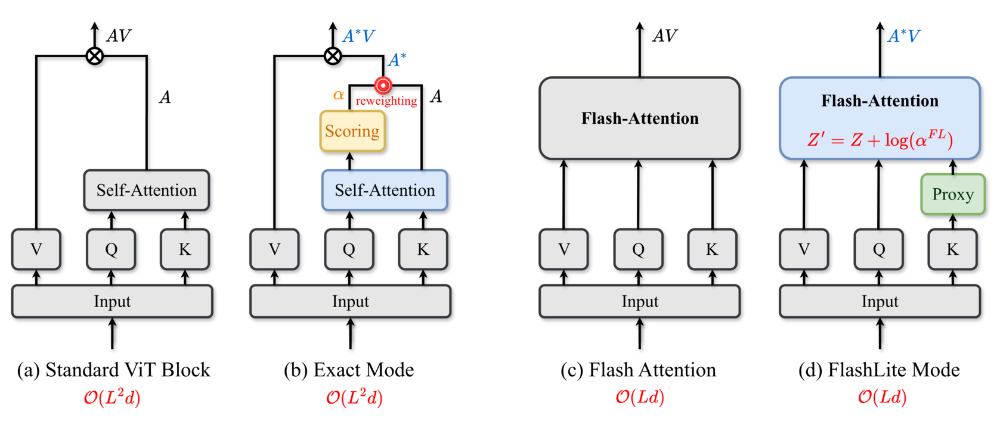
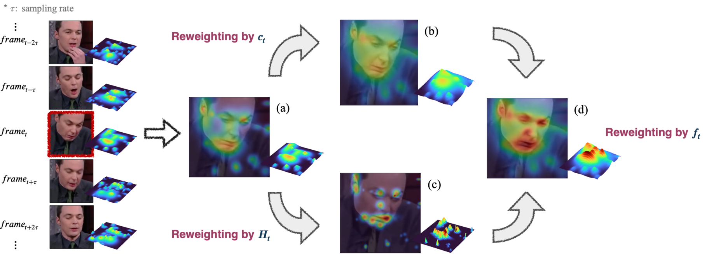
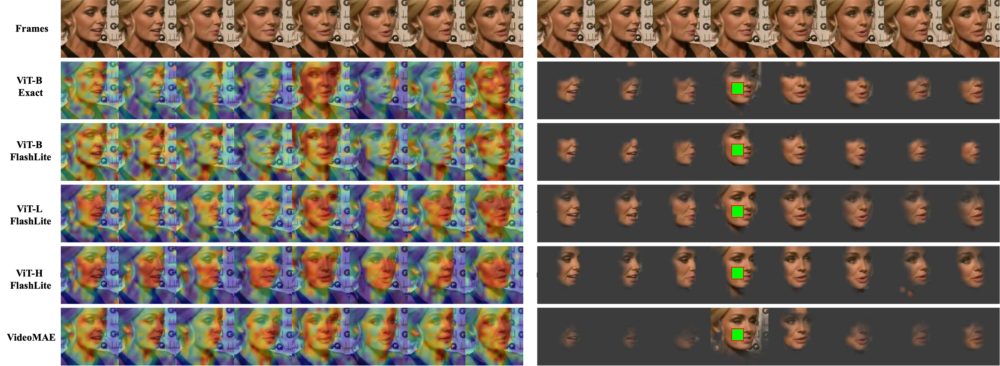
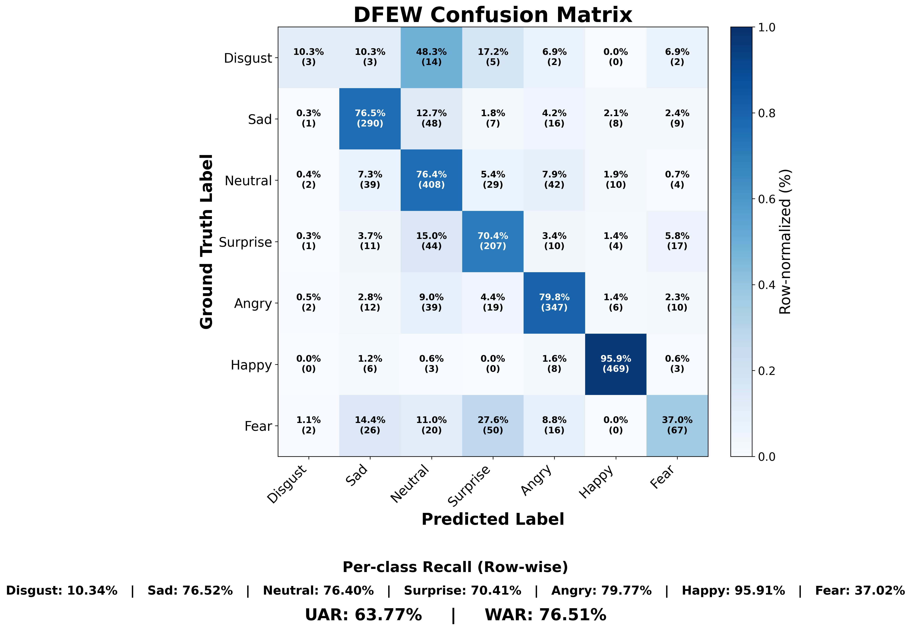
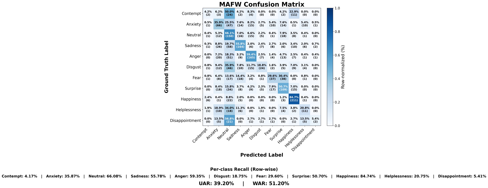
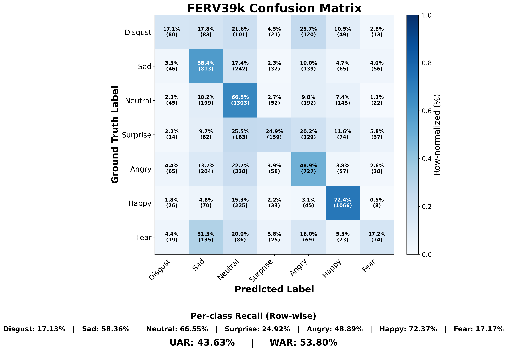
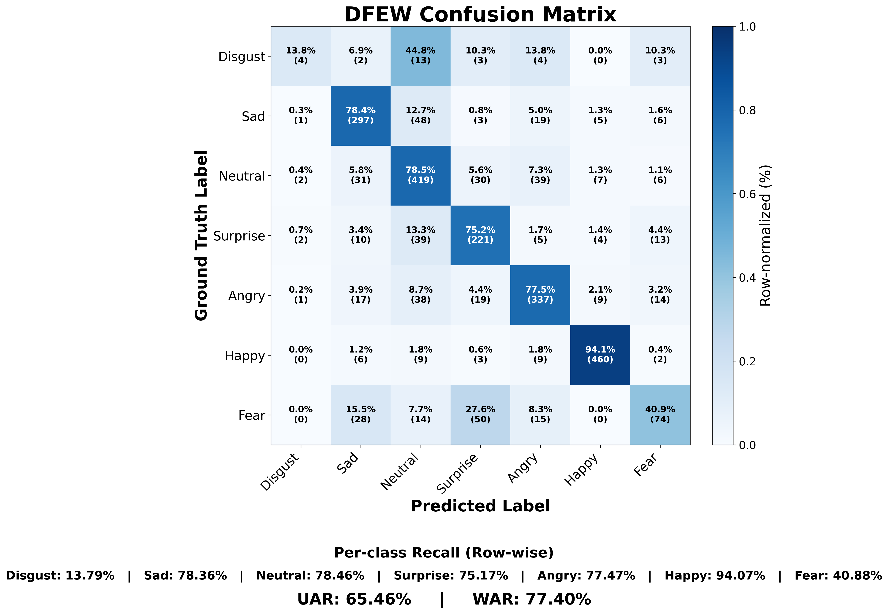
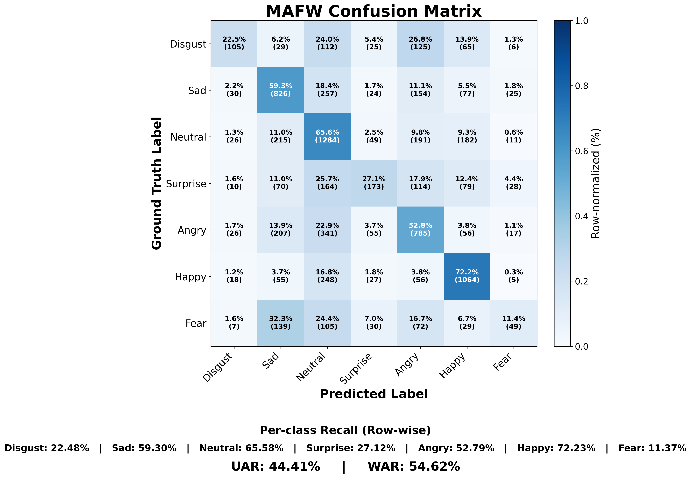
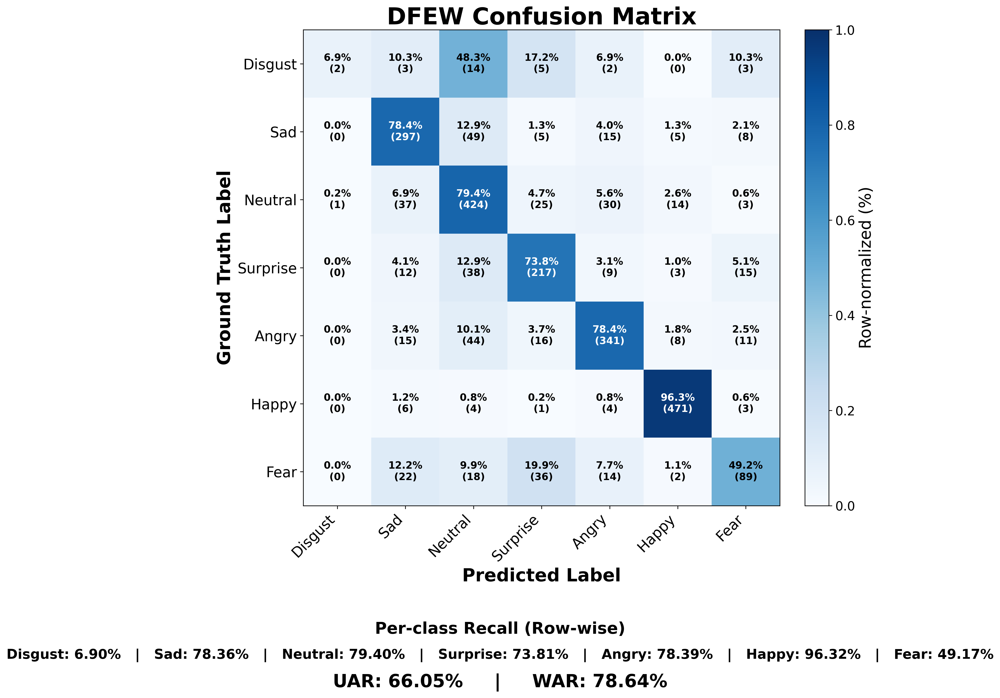
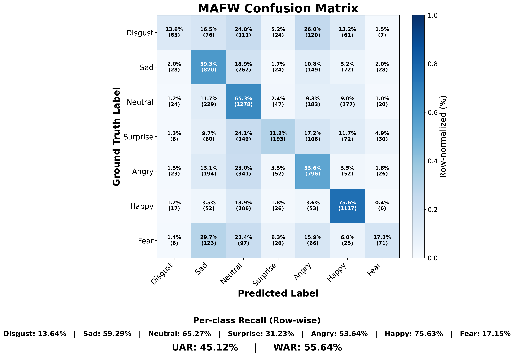

# MiRA: Reweighting Framewise Attention in Video Transformers for Facial Expression Understanding.
[Reweighting Framewise Attention in Video Transformers for Facial Expression Understanding (ECCV 2026)](https://arxiv.org/abs/2606.30611) <br>
Seongro Yoon<sup>1</sup> &nbsp;&nbsp;, 
Donghyeon Cho<sup>2</sup> &nbsp;&nbsp;, 
Jinsun Park<sup>3</sup> &nbsp;&nbsp;,
François Brémond<sup>1</sup> <br>
<sup>1</sup> Inria, France &nbsp;&nbsp;
<sup>2</sup> Hanyang University, South Korea &nbsp;&nbsp; 
<sup>3</sup> Pusan National University, South Korea

#### Contact: seong-ro.yoon@inria.fr
> We are actively conducting interdisciplinary research at the intersection of affective computing and related fields, and are always open to discussions and collaborations. Feel free to reach out!

<p align="center">
  
</p>
<p align="center">
  
</p>
<p align="center">
  
</p>

MiRA (Marginal-induced Attention Redistribution) is a parameter-free, lightweight plug-in framework for foundational video transformers that introduces frame-marginal attention redistribution for facial expression understanding. It encourages the model to focus on subtle intra-face spatio-temporal dynamics, enabling more effective representation learning during large-scale self-supervised pre-training as well as downstream fine-tuning. MiRA provides both **Exact mode** for principled post-softmax attention redistribution and **FlashLite** mode, which seamlessly integrates with FlashAttention kernels to provide an efficient approximation of the exact formulation while preserving high training and inference efficiency.

## Datasets

**Pre-training: million-scale unlabeled facial videos**
- [VoxCeleb2](https://www.robots.ox.ac.uk/~vgg/data/voxceleb/vox2.html) (1.2M videos)

**Fine-tuning: downstream facial expression recognition**
- [DFEW](https://dfew-dataset.github.io/) (12K video clips)
- [MAFW](https://mafw-database.github.io/MAFW/) (10K video clips)
- [FERV39k](https://wangyanckxx.github.io/Proj_CVPR2022_FERV39k.html) (39K video clips)

**k-NN Probing: micro-expression recognition**
- [SAMM](https://repository.mmu.ac.uk/articles/journal_contribution/SAMM_A_Spontaneous_Micro-Facial_Movement_Dataset/32439684?file=64997748)
- [MMEW](https://github.com/benxianyeteam/MMEW-Dataset)

The original datasets should be downloaded from their respective official websites due to their licensing policies. <br>
We provide the **metadata CSV files** (in [`datasets/dataSpecCSV_combined/`](datasets/dataSpecCSV_combined)) used in our experiments, containing dataset-specific information required for training and evaluation.

For convenience, we also provide a **sample directory structure** (one example path per dataset) illustrating the expected organization of the downloaded datasets. See the example directory layouts under [`datasets/`](datasets/).

## Environment

Our implementation was developed and tested with the following environment:

- Python 3.8.19
- CUDA 12.1
- cuDNN 9.2
- GCC 11.3
- PyTorch 2.6.0
- torchvision 0.21.0
- timm 0.4.12
- decord 0.6.0
- deepspeed 0.16.6

Install the required Python packages via:

```bash
pip install -r requirements.txt
```

## Main Results with Confusion Matrices

Representative confusion matrices after **VoxCeleb2 pre-training** and subsequent **fine-tuning on each target dataset**: **DFEW (Fold 1)**, **MAFW (Fold 1)**, and **FERV39k**, using **FlashLite** with ViT-B, ViT-L, and ViT-H. Click each image to view it in full size. Additional confusion matrices for other folds are available under the corresponding [`confusion_matrix/`](confusion_matrix/) subdirectories.

| Backbone | DFEW (Fold 1) | MAFW (Fold 1) | FERV39k |
|:---------:|:-------------:|:-------------:|:--------:|
| **ViT-B FlashLite** |  |  |  |
| **ViT-L FlashLite** |  |  |  |
| **ViT-H FlashLite** |  |  |  |

## Pre-training

## Fine-tuning with pre-trained models

## Citation

If you find this work useful in your research, please consider citing:

```bibtex
@article{yoon2026reweighting,
  title={Reweighting Framewise Attention in Video Transformers for Facial Expression Understanding},
  author={Yoon, Seongro and Cho, Donghyeon and Park, Jinsun and Br{\'e}mond, Fran{\c{c}}ois},
  journal={arXiv preprint arXiv:2606.30611},
  year={2026},
  note={Accepted to ECCV 2026}
}
```

